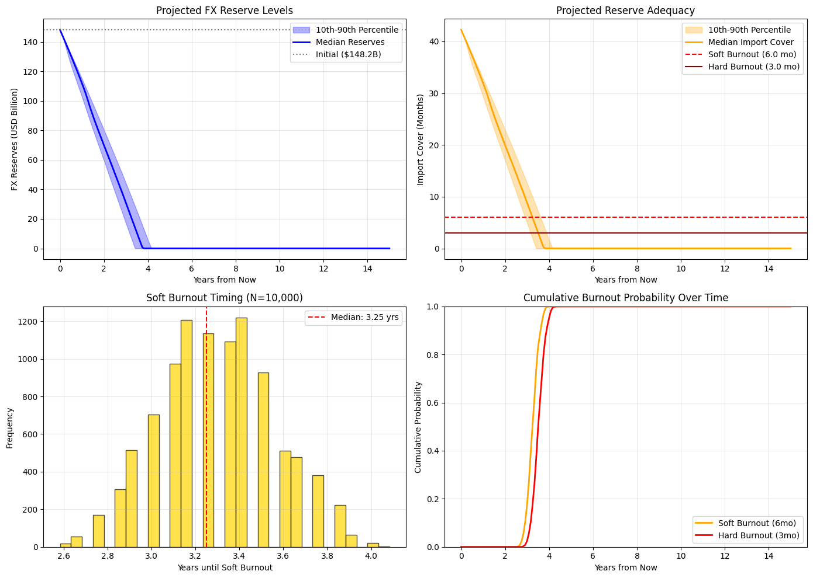

# Rupiah Reserve Exhaustion Simulator (RRES) 

A Monte Carlo simulation of Indonesia's foreign exchange reserve adequacy. It Estimates the probability of a _"Burnout"_— the point at which reserves
fall below critical import cover thresholds.

[](https://colab.research.google.com/github/siregarmr/rupiah-reserve-exhaustion/blob/main/Rupiah_Reserve_Exhaustion.ipynb)

## Overview

The simulation projects 10,000 possible paths over a 15‑year horizon for Indonesia's FX reserves. It models the monthly net change in reserves as:
```
    Net Change = (Exports - Imports) - (Debt Principal + Debt Interest) - Capital Outflow
<=> Net Change = Trade Surplus - External Debt Service - Capital Outflow
```

A _Soft Burnout_ occurs when reserves drop below 6 months of import cover. A _Hard Burnout_ occurs below 3 months (the IMF adequacy threshold).

The model uses live monthly trade data from the BPS API (aggregated over all two‑digit HS codes) and structural data from the World Bank API. All parameters are tunable, allowing users to test alternative scenarios.

## Data Sources

| Variable | Source | Update Frequency |
|:---------|:-------|:-----------------|
| Monthly Exports & Imports | BPS API (`dataexim` endpoint) | Daily via GitHub Action |
| FX Reserves | Manual (latest BI release) | User‑editable |
| External Debt (Govt) | World Bank API / Manual | Annual |
| Inflation (YoY) | World Bank API | Annual |
| GDP | World Bank API | Annual |
| Debt Interest | Manual (APBN budget) | User‑editable |
| Capital Outflow | Manual (baseline estimate) | User‑editable |

## Running the Simulation

### Option 1: With a BPS API Key (Live Data)

1. Obtain a free API key from the [BPS Developer Portal](https://webapi.bps.go.id/developer/).
2. In Google Colab, add a secret named `BPS_API_KEY` with your key (or enter it interactively when prompted).
3. Run the notebook. The latest monthly trade data will be fetched directly from BPS.

### Option 2: Without an API Key (Pre‑fetched Data)

If no API key is provided, the notebook automatically loads the most recent trade data from the `bps_trade_latest.csv` file in this repository.

This file is updated daily via a GitHub Action using the repository owner's API key. You can run the simulation immediately without any setup.

## Tuning Parameters

All economic assumptions and shock parameters are exposed in Cell 2 under the `DEFAULT_MANUAL` dictionary. You can also override them by placing a `rres_manual_parameters.csv` file in the same directory.

| Parameter | Default | Description |
|:----------|:--------|:------------|
| `fx_reserves_usd` | 148.2e9 | Current FX reserves (USD) |
| `baseline_capital_outflow_usd` | 500e6 | Monthly capital outflow (USD) |
| `soft_burnout_months` | 6.0 | Warning threshold (months of import cover) |
| `hard_burnout_months` | 3.0 | Crisis threshold |
| `shock_prob_monthly` | 0.05 | Probability of a trade/financial shock each month |
| `trade_shock_multiplier` | 0.7 | Exports drop to 70% during a shock |
| `outflow_shock_multiplier` | 3.0 | Capital outflow triples during a shock |

## Example Output (April 2026)



```
=== SIMULATION RESULTS ===
5 years:
Soft Burnout (6mo): 100.0%
Hard Burnout (3mo): 100.0%
10 years:
Soft Burnout (6mo): 100.0%
Hard Burnout (3mo): 100.0%
15 years:
Soft Burnout (6mo): 100.0%
Hard Burnout (3mo): 100.0%

Median time to Soft Burnout: 3.25 years
Median time to Hard Burnout: 3.58 years
```

Note: Results depend on current data and parameter assumptions. Re‑run the notebook to see updated probabilities.

## Repository Structure

```
rupiah-reserve-exhaustion/
├── Rupiah_Reserve_Exhaustion.ipynb          # Main notebook
├── update_trade_data.py                     # Script for GitHub Action
├── bps_trade_latest.csv                     # Daily refreshed trade data
├── .github/workflows/update_trade_data.yml  # Automation workflow
├── rres_manual_parameters.csv               # Optional user overrides
└── README.md                                # This file
```

## Disclaimer

This is a simplified stress‑test model built for educational and discussion purposes only.
- It does not predict the future.
- It does not constitute financial, investment, or policy advice.
- The model does not account for central bank policy responses or structural reforms.

## License

This project is released under the BSD 3‑Clause License. See the `LICENSE` file for details.
